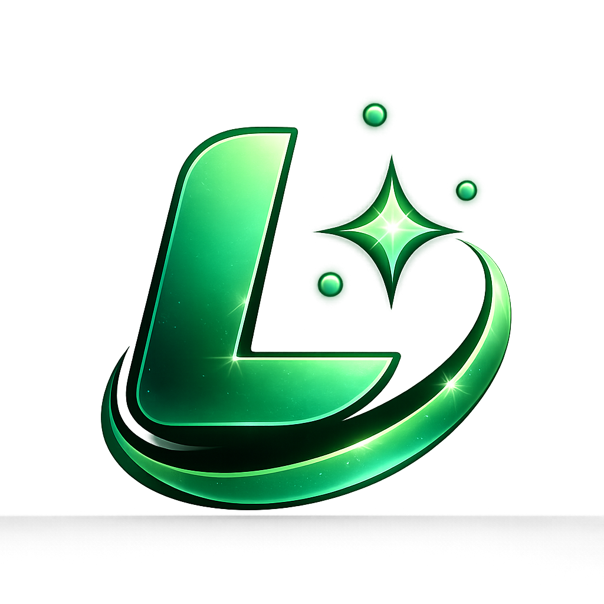

<div align="center">



# Lumina Gen

**AI-powered image style transfer. Upload once, get a gallery-ready result.**

[](https://nextjs.org)
[](https://stability.ai)
[](https://www.typescriptlang.org)
[](https://tailwindcss.com)
[](https://clerk.com)
[](https://neon.tech)
[](https://imagekit.io)


</div>

---

## ✨ What it does

Lumina Gen turns any photo into a richly styled scene — no design skills needed.

| Style | Description |
|-------|-------------|
| 🎬 **Storybook 3D** | Pixar-DreamWorks cinematic render |
| 🎌 **Anime Cel** | Kyoto Animation / Makoto Shinkai linework |
| 🧸 **Clay Render** | Aardman-style stop-motion sculpt |
| ✨ **Pixart** | Bright family-animation 3D charm |
| 🟦 **Voxel Block** | Minecraft-inspired cubic geometry |
| 🏛️ **Marble Sculpture** | Classical carved-stone portraiture |

---

## 🛠 Tech Stack

| Layer | Tool |
|-------|------|
| Framework | [Next.js 16](https://nextjs.org) (App Router, Turbopack) |
| Language | TypeScript 5 |
| Styling | Tailwind CSS v4 + shadcn/ui |
| AI | [Stability AI SD3](https://stability.ai) — image-to-image |
| Auth | [Clerk](https://clerk.com) |
| Database | [Neon](https://neon.tech) (PostgreSQL, serverless) |
| Media CDN | [ImageKit](https://imagekit.io) |
| Monitoring | [Sentry](https://sentry.io) |
| Fonts | Plus Jakarta Sans · Lora · IBM Plex Mono |

---

## 🚀 Quick Start

```bash
git clone https://github.com/your-username/lumina-gen
cd lumina-gen
npm install
```

Copy `.example.env` → `.env` and fill in your keys:

```env
DATABASE_URL=
NEXT_PUBLIC_IMAGEKIT_PUBLIC_KEY=
NEXT_PRIVATE_IMAGEKIT_PRIVATE_KEY=
SENTRY_AUTH_TOKEN=
NEXT_PUBLIC_CLERK_PUBLISHABLE_KEY=
CLERK_SECRET_KEY=
STABILITY_API_KEY=
```

```bash
npm run dev        # http://localhost:3000
```

---

## 📁 Project Structure

```
app/
├── api/generate-image/   # Stability AI SD3 route
├── api/upload/           # ImageKit upload route
├── studio/               # Main generation workspace
└── page.tsx              # Landing page
components/studio/        # Controls panel, preview, history
lib/                      # Stability models, style presets, quota
context/                  # Studio workbench state
db/                       # Neon / PostgreSQL queries
```

---

## 🔑 Keywords

`AI image styling` · `Stability AI` · `Stable Diffusion 3` · `SD3` · `photo to anime` · `image style transfer` · `Pixar 3D filter` · `clay render AI` · `generative AI` · `Next.js AI app` · `AI art generator` · `ImageKit CDN` · `Clerk auth` · `Neon PostgreSQL`

---

<div align="center">
  <sub>Built with ❤️ using Stability AI · Next.js · Clerk · Neon · ImageKit</sub>
</div>
